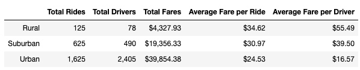
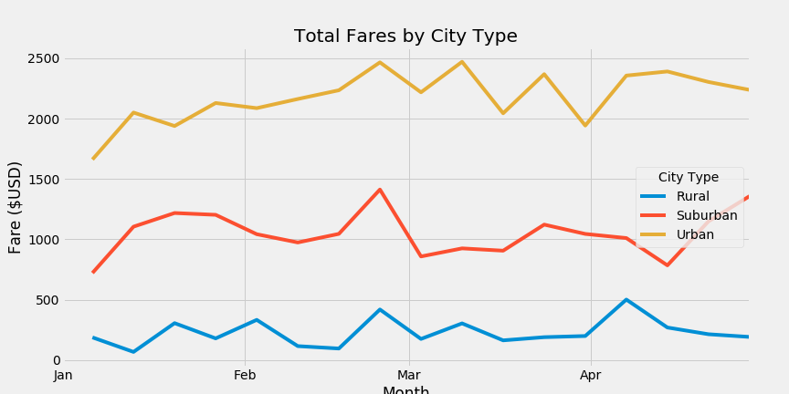
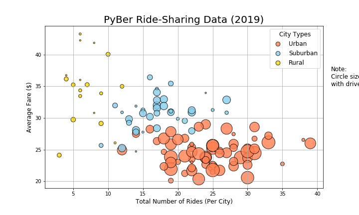
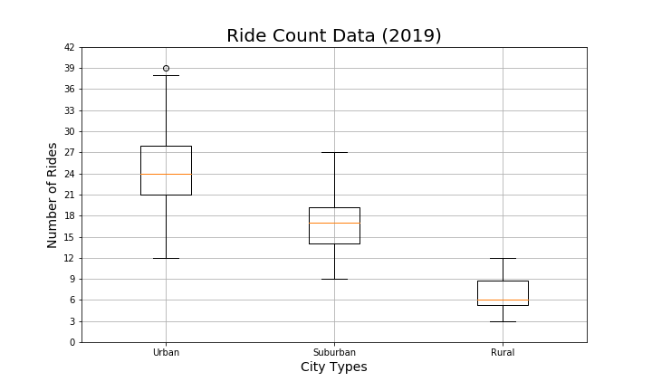
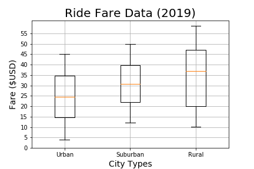
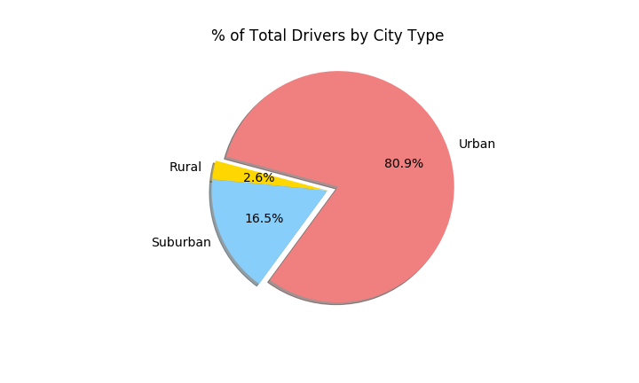

# PyBer Analysis Challenge
## Overview of the Project
V. Isualize from PyBer has asked to create an overall snapshot of the ride-sharing data. The following are to be included:
1. Create a summary DataFame including Total Rides, Total Drivers, Total Fares, Average Fare per Ride, and Average Fare per Driver.
2. Create a Multiple-Line Plot for the Sum of the Fares for Each City Type.
3. Create a Bubble Chart to compare ride count, average fare and driver count by city type.
4. Create Box and Whisker plots to compare data by city type.
5. Create a Pie chart with exploded sections.

## Resources
- Data Source: city_data.csv, ride_data_challenge.csv
- Software: Python 3.6.1, Jupyter Notebook, matplotlib

## Summary of Results
### Summary DataFrame

Looking at city type, the total rides, total drivers and total fares is greatest in urban cities and least in rural cities.  However, the average fare per ride is greatest in rural cities at $34.62, with suburban cities at $30.97, but for urban cities is only $24.53. Also, because the number of drivers is so large in urban cities, the average fare per driver is much lower ($16.57) than in rural cities ($55.49).

### Multi-Line Plot

Looking at the sum of the fares by city type over time, we can see that the total fares in urban cities is much greater than in either suburban or rural cities.
- The line plot for urban cities often shows an average fare more than four times that of the rural cities, sometimes five times greater.
- Both the suburban and rural cities saw a peak in total fares at the end of February.
- The highest sum for rural cities was in early April 2019.
- The highest sum for suburban and urban cities was at the end of February 2019.
- Suburban fares seemed to increase through January but then taper off until the last week in February.
- Urban fares increased through the end of February and then became intermittent through March.

While the total fares is much lower in rural cities, the stability shown in the line plot and the average fare per ride and per driver shows that having drivers in rural cities is profitable. The total fares in urban cities make up for the lower averages per ride and per driver.

### Bubble Chart

The size of the bubbles correlates to the driver count per city. The bubble chart shows that the highest average fares are all in the rural cities. However, the largest group is shown in the lower right portion of the chart with the urban cities having the larger total number of rides and total number of drivers.

### Box and Whisker Plots

This plot shows that minimum number of rides in urban cities is the same as the maximum number of rides in rural cities. There is also an outlier for urban cities of 39 rides. Looking at the suburban data, the first three quartiles lie below the first quartile of the urban cities.

The rural areas excel at ride fares as shown with the highest median, Q3 and maximum values. It is interesting to see that the lowest minimum is actually in urban cities with less than $5, while suburban cities have the highest minimum fares above $10.

### Pie Charts with Exploded Sections

It is obvious that there are more drivers in urban cities when looking at the pie chart to see that about 80% of the total drivers are in urban cities. While the fares are highest in rural cities, these drivers only make up 2.6% of the total drivers.
